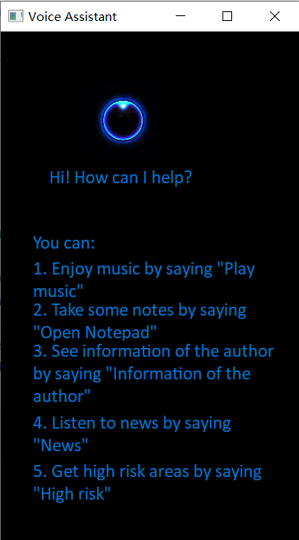

# Assignment2 ASR
Implement of an ASR program with GUI in python. Including following functions:

- Play music
- Open notepad
- See information of the author(open the browser and go bilibili main page of me)
- Listen to news
- Get high risk areas in China now

## Prerequisites

requirements.txt

```
PyQt5==5.15.6
pywin32==303
requests==2.27.1
SpeechRecognition==3.8.1
```

## Usage

```shell
python asr.py google  	# use google api to implentment asr
python asr.py        	# use sphinx api to implentment asr (default)
```

I recommend to run the command in the first line if you can access to Google, because Google asr api  is more accurate. Or you can run command in line 2 if you can't access to Google.

## Code Modifications

In addition to the two functions "Play music" and "Open notepad", I add three new function to the program ,including "See information of the author","Listen to news“ and "Get high risk areas in China now".



For the Gui, I change the size and add the description of new functions.

### Code Framework

We can divide the function of the program into there parts. First is the display of the graphical interface, second is recording audio and the last one is calling other functions. These three functions need to be executed in parallel, so the program needs at least three threads.

```python
class MainWindow(QtWidgets.QMainWindow, Ui_MainWindow):
    def __init__(self, parent=None):
        super(MainWindow, self).__init__(parent=parent)
        self.setupUi(self)
        # Initialize a timer
        self.timer = QTimer(self)
        # Define timeout connection start_app
        self.timer.timeout.connect(self.start)
        # Define time tasks as one-off tasks
        self.timer.setSingleShot(True)
        # Start time task
        self.timer.start()
        # Instantiate a thread
        self.work = WorkThread()

    def start(self):
        self.work.start()
```

Main window runs in the first thread and creates a new thread running the speech recognizing program in constructor. Speech recognizing thread is defined as follow:

```python
class WorkThread(QThread):

    def __int__(self):
        # Initialization function, default
        super(WorkThread, self).__init__()

    def run(self):
        mic = sr.Microphone()
        r = sr.Recognizer()
        with mic as source:
            while (1):
                try:
                    r.adjust_for_ambient_noise(source)
                    audio = r.listen(source)
                    if sys.argv[-1] == 'google':
                        content = r.recognize_google(audio)
                    else:
                        content = r.recognize_sphinx(audio)
                except:
                    print("Speech recognition failed")
                    continue
                print(content)
                if content.lower() == 'play music':
                    threading.Thread(target=play_music).start()
                elif content.lower() == 'open notepad':
                    threading.Thread(target=open_notepad).start()
                elif content.lower() == 'information of the author':
                    threading.Thread(target=open_bilibili).start()
                elif content.lower() == 'news':
                    threading.Thread(target=get_news).start()
                elif content.lower() == 'high risk':
                    threading.Thread(target=get_high_risk).start()
```

The speech recognition thread circulates the recording and recognition function, and creates a new thread and executes the corresponding function if the recognized result matches the preset keywords. To improve accuracy of speech recognition I use Google api. As the recognizing sometimes fills, I put it in a try except block.

### Functions implements

```python
def play_music():
    os.system('music.mp3')

def open_notepad():
    os.system('notepad.exe')

def open_bilibili():
    webbrowser.open('https://space.bilibili.com/435822845?spm_id_from=333.1007.0.0')

def get_news():
    d = date.today()
    url = "http://api.tianapi.com/ncov/index?key=d334721cf6eba2d619a5855420ec352c&data="+str(d)
    r = requests.get(url)
    news = r.json()
    speaker = win32com.client.Dispatch("SAPI.SpVoice")
    speaker.Speak(news['newslist'][0]['news'][0]['summary'])

def get_high_risk():
    d = date.today()
    url = "http://api.tianapi.com/ncov/index?key=d334721cf6eba2d619a5855420ec352c&data="+str(d)
    r = requests.get(url)
    news = r.json()
    speaker = win32com.client.Dispatch("SAPI.SpVoice")
    speaker.Speak(f'截止{d.year}年{d.month}月{d.day}日，我国疫情高风险地区有，'+','.join(news['newslist'][0]['riskarea']['high']))
```

For playing music, opening notepad and get author's information, I just call the apis of the system. For getting news and getting high risk areas, I use tianapi to get relevant information for the Internet and then parse it to get target information, last call win32com api to read it.

## Improve the accuracy of speech recognition

In this program, I use `recognize_sphinx` as the default speech recognition api because it can work offline the CMU Sphinx engine. However its accuracy is so low that it interferes with user usage. SpeechRecognition package also provides other apis including `recognize_bing`, `recognize_google`, `recognize_google_cloud`, `recognize_houndify`， `recognize_ibm` and `recognize_wit`, we can try these interfaces to improve the accuracy of recognition. SpeechRecognition comes with the default API key for the Google Web Speech API, so we can use it directly. The other five apis all require authentication using either an API key or a username/password combination, so I use  Google Web Speech API to improve accuracy of my program. Following are two ways to run the program.

```shell
python asr.py google  	# use google api to implentment asr
python asr.py        	# use sphinx api to implentment asr (default)
```

